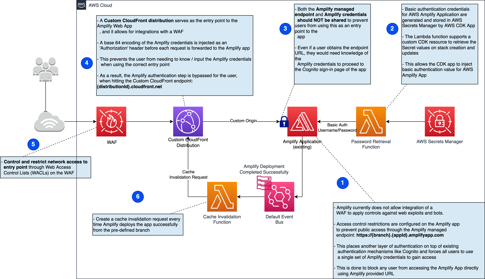

# Enable WAF for Amplify Hosted web applications

Many AWS Amplify Web Applications do not have a firewall attached at all,
simply because the integration with AWS WAF does not exist natively.
Thus, this template can be a quick and effective way to improve the security of your web application.

Following the steps in this pattern will allow users to create an Amazon CloudFront Distribution
associated with an AWS WAFv2 WebACL configured with basic AWS Managed Rulesets.
It will also demonstrate how an extra layer of security can be applied to the AWS Amplify application
to stop users from circumventing the AWS WAFv2 configuration.
All traffic into the application must now go through the new Amazon CloudFront Distribution.

The pattern is supplied with a self-contained sample CDK construct which can be used as-is
or modified to enable WAF integration on an existing Amplify web application.
The code also enables automated cache invalidation of the newly created CloudFront distribution
every time new code is deployed for the Amplify-hosted Web App.

## Prerequisites

---

- An active Amazon Web Services (AWS) account
- An existing AWS Amplify hosted web application
- A workspace with CDK v2 CLI, AWS CLI and Python 3.8+ installed
- Familiarity with AWS CDK - python
- Familiarity with AWS CLI

## Limitations

---

- You can no longer use custom domains with AWS Amplify but will need to use custom domain with Amazon CloudFront
- Automated secrets rotation is not enabled so stack re-deployment is
  required to regenerate new secrets for AWS Amplify app basic authentication
- A new instance of the stack needs to be deployed for each AWS Amplify app and branch that needs AWS WAF protection enabled

## Architecture

---

### Target architecture

Deploying the supplied CDK code will deploy the architecture seen below into the target AWS account.
The Amplify Application is not created by the CDK code and is expected to pre-exist within the target AWS account.

Deploying an AWS WAF using the supplied CDK code is optional,
you can integrate an existing WAF as long as its attachable to a CloudFront distribution.



### Target technology stack

- AWS Web Application Firewall
- Amazon CloudFront
- AWS Secrets Manager

This pattern provides deployment through AWS CDK which can easily be automated in CI/CD pipelines.

> Note : The deployment of this CDK code adds configuration
> to existing Amplify App. This should not create issues for the
> IaC operations performed on the Amplify resource outside this stack.

## Tools

---

- [AWS CDK v2](https://docs.aws.amazon.com/cdk/v2/guide/home.html)
  (tested with v2.43.1) -
  AWS Cloud Development Kit (AWS CDK) is a software development framework for
  defining cloud infrastructure as code and provisioning it through AWS CloudFormation
- [Python (v3+)](https://www.python.org/) -
  Python is a high-level, interpreted, general-purpose programming language.
- [AWS CLI](https://docs.aws.amazon.com/cli/latest/userguide/cli-chap-welcome.html) -
  The AWS Command Line Interface (AWS CLI) is an open-source
  tool for interacting with
  AWS services through commands in your command-line shell.
  With minimal configuration, you can run AWS CLI commands that
  implement functionality equivalent to that provided by the
  browser-based AWS Management Console from a command prompt.
- [AWS CloudFormation](https://docs.aws.amazon.com/AWSCloudFormation/latest/UserGuide/Welcome.html) -
  AWS CloudFormation helps you model and setup your AWS resources,
  provision them quickly and consistently, and manage them throughout their lifecycle.

## Deployment Steps

---

Follow below steps to enable WAF on existing Amplify Application using AWS CDK constructs

- Download the source code from Github and setup virtual env

  > We recommend using AWS Cloud9 as the IDE for this pattern,
  > but you can also use another IDE (for example, Visual Studio Code or IntelliJ IDEA).

  - Run the following command in a terminal to clone
    the sample CDK application's repository into your IDE:

    ```console
    git clone https://github.com/aws-samples/aws-cdk-amplify-with-waf.git
    ```

  - Change directory to the newly downloaded source code.

    To create the virtualenv for the CDK application its
    required that there is a python3
    (or python for Windows) executable in your path with access to the venv
    package.

  - To manually create and activate a virtualenv on MacOS and Linux:

    ```console
    python3 -m venv .venv
    source .venv/bin/activate
    ```

  - To manually create and activate a virtualenv on Windows:

    ```console
    python -m venv .venv
    .venv\Scripts\activate.bat
    ```

    > Additionally on Windows change the `python3` to `python`
    in the entry point (`app` key) in `cdk.json`

  - Install the dependencies

    ```console
    pip install -r requirements.txt
    ```

- Bootstrap the CDK app

  - Ensure that you have the correct AWS CLI credentials
    configured for the account in which you want to deploy the stacks.
    Alternatively pass the correct profile using
    `--profile PROFILE_NAME` in all cdk commands

    ```console
      cdk bootstrap aws://ACCOUNT-NUMBER/REGION-1 aws://ACCOUNT-NUMBER/REGION-2
    ```

    > Region-1 must be the `us-east-1` region to deploy the Web ACL
    >
    > Region-2 will be the region in which Amplify App exists

- Update below parameters in `cdk.json` file.

    **app_id** :  Amplify App Id for the existing amplify app to which you want to associate the WAF.
    This is the last part of the Amplify App Arn
    usually in the format `arn:PARTITION:amplify:REGION:ACCOUNT_ID:apps/APP_ID`.
    The Amplify App Arn can be found from the AWS Console.

    **branch_name** :  Branch corresponding to the deployment which
    needs to be protected using WAF

    **web_acl_arn** : Provide ARN of existing WebACL if you want an existing WebACL
    associated with the Amplify App. If you do not have an existing WebACL
    to attach, deploy the CustomWebAcl stack from this cdk app to
    create a WebACL with a pre-defined set of AWS Managed rules.

- (Optionally) Deploy WebACL stack

  - Optionally deploy the Web ACL creation stack if not using existing Web ACL.
    Use the output to update web_acl_arn in cdk.json.
    If using an existing Web ACL skip to next step.

    ```console
    cdk deploy CustomWebAclStack
    ```

- Deploy Custom Amplify Distribution stack

  - Deploy the CDK stack that enables WAF protection for
    Amplify as described in the architecture diagram

    ```console
    cdk deploy CustomAmplifyDistributionStack
    ```

- Verify the deployment

  - Use the output from the CustomAmplifyDistribution stack to test the Web Application.
    The Web Application should now be accessible using the CloudFront URL.

  - Try accessing the direct Amplify endpoint for the Web App which
    should now prompt for basic authentication.

  - Update the Web Application and commit changes to verify that
    Amplify deploys the app successfully and the
    Custom CloudFront distribution is invalidated automatically.

## References

- [AWS WAF](https://aws.amazon.com/waf/)
- [AWS Secrets Manager](https://aws.amazon.com/secrets-manager/)
- [Amazon CloudFront](https://aws.amazon.com/cloudfront/)
- [AWS Amplify](https://aws.amazon.com/amplify/)
- [Customise CloudFront domain](https://docs.aws.amazon.com/AmazonCloudFront/latest/DeveloperGuide/CNAMEs.html)

## [Contributing Guide](CONTRIBUTING.md)

---

Read our contributing guide to learn about our development process,
how to propose bugfixes and improvements, and how to
integrate your changes in this repository

## [Code of Conduct](CODE_OF_CONDUCT.md)

---

## [License](LICENSE)

---

This library is licensed under the MIT-0 License. See the LICENSE file.
